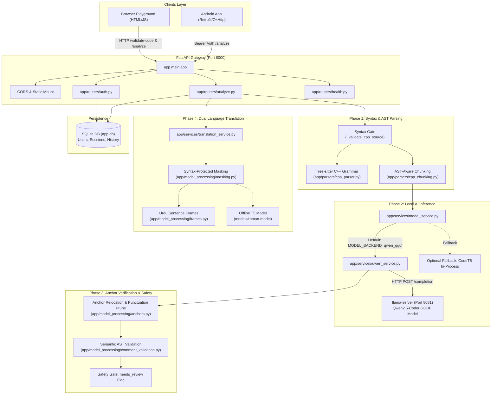

# Code Analyzer Architecture Overview

## 1. Executive Summary

The **Code Analyzer** is a hybrid C++ code analysis, explanation, and commenting backend designed for students and software developers. It provides intelligent, line-anchored code reviews with dual-language explanations (**English** and **Roman Urdu**), backed by deterministic static analysis and local large language model (LLM) inference.

### Key Capabilities
- **Zero-Build Browser Playground:** Built-in web editor (`/`) served directly by FastAPI without requiring Node.js or a bundler.
- **Tree-sitter Syntax Gating:** Instant live AST validation (`POST /validate-code`) that rejects non-C++ code or malformed syntax before any model inference occurs.
- **Syntax-Aware Chunking:** Intelligently splits large C++ files across function/class boundaries into token-bounded chunks matching the model's training distribution.
- **Line-Anchored Commenting:** Models emit `{line, code, comment}` anchors. Instead of blindly trusting generated source rewrites, the backend verifies quoted lines against the original source code, relocating or pruning drifted annotations.
- **Code-Preserving Roman Urdu Translation:** Preserves C++ syntax and variable tokens intact while converting explanations and comments into natural Roman Urdu via sentence framing or an offline sequence-to-sequence model.
- **Safe Optimization Proving:** Generates and benchmarks algorithmic improvements (`POST /optimize`), verifying correctness via test execution before proposing changes.
- **Lightweight Authentication & History:** SQLite database with PBKDF2 password hashing and token-based session tracking for mobile and web clients.

---

## 2. System Architecture Diagram



---

## 3. End-to-End Pipeline Walkthrough

### Step 1: Live Input Validation (`POST /validate-code`)
- **Purpose:** Gives real-time typing feedback in the browser playground and guards all analysis endpoints.
- **Mechanism:** Passes C++ source into [`cpp_parser.parse()`](file:///Volumes/Data/saffi/fyp_backend/app/parsers/cpp_parser.py). If tree-sitter detects parse errors (`root.has_error`), it traverses child nodes to locate the exact syntax error line and returns actionable feedback (e.g., `"Check syntax near line 4: missing semicolon"`).
- **Zero Cost:** Requires no authentication, runs with sub-millisecond latency, and executes no LLM inference.

### Step 2: AST-Aware Chunking (`cpp_chunking.py`)
- **Why It Exists:** Fine-tuned code models perform best on focused snippets (15–30 lines). Sending large multi-function files at once degrades instruction following.
- **Mechanism:** Walks the tree-sitter AST and groups nodes by `UNIT_TYPES` (`function_definition`, `class_specifier`, `namespace_definition`, etc.). 
- Keeps indivisible units intact while slicing code into contiguous token-bounded chunks (default target: ~300 tokens).

### Step 3: Model Inference (`qwen_service.py` & `llama-server`)
- **Serving Topology:** Runs external `llama-server` process on `http://127.0.0.1:8081` using quantised GGUF weights (`qwen-cpp-review-v3-q4_k_m.gguf`).
- **Speed & Efficiency:** Achieves ~17 tokens/second on CPU (compared to ~2 tokens/second for unquantised in-process models), without forcing FastAPI workers to install heavyweight PyTorch wheels.
- **Instruction Prompting:** Sends structured task instructions asking for an array of JSON objects: `{"line": int, "code": str, "comment": str}` and an `explanation`.
- **Defect Probing:** Uses fine-tuned prompt instructions (`DESCRIBE_EFFECTS`) instructing the model not to blindly assume submitted code is correct.

### Step 4: Anchor Repair & Semantic Validation
- **The Problem:** LLMs often hallucinate line numbers (e.g., putting comment on line 12 instead of line 15) or comment on meaningless lines (e.g., closing braces `}`).
- **Anchor Relocation:** Quoted source text is 100% reliable even when line numbers drift. [`repair_anchors()`](file:///Volumes/Data/saffi/fyp_backend/app/model_processing/anchors.py) matches the quoted snippet back to the actual source lines.
- **Punctuation & Numeric Filters:** Automatically drops comments attached to pure braces, comments, or isolated numbers.
- **Semantic AST Filter:** [`comment_validation.py`](file:///Volumes/Data/saffi/fyp_backend/app/model_processing/comment_validation.py) inspects whether the comment contradicts the node type (e.g., claiming a variable declaration is a loop).
- **`needs_review` Calculation:** If anchors were discarded due to semantic mismatch or syntax failure, `needs_review=True` alerts the user that model drift was detected.

### Step 5: Code-Preserving Roman Urdu Translation
- **The Problem:** Naive machine translation alters C++ variables and language keywords (e.g., translating `for (int i=0; ...)` or turning `sum` into an Urdu word).
- **Masking Engine:** [`translate_protecting_code()`](file:///Volumes/Data/saffi/fyp_backend/app/model_processing/masking.py) replaces code identifiers and syntax with unicode delimiters (e.g., `⟦0⟧`).
- **Dual Translation Engine:**
  1. *Sentence Frames:* Matches common grammatical structures in code explanation to produce natural Urdu sentence ordering (verb-final syntax).
  2. *T5 Translation Model:* For complex prose, leverages an offline fine-tuned T5 translation model (`models/roman-model/t5-stage2-c`).
- **Unmasking:** Restores the exact C++ identifiers into the translated Roman Urdu text.

---

## 4. API Endpoint Reference

| Method | Path | Auth Required | Description |
| :--- | :--- | :---: | :--- |
| `GET` | `/` | No | Serves the browser playground UI (`app/web/index.html`). |
| `GET` | `/health` | No | Cheap liveness probe confirming process availability. |
| `POST` | `/validate-code` | No | Real-time C++ syntax checker returning validity and error line. |
| `POST` | `/analyze` | Optional | Main review pipeline (returns input code, commented code, explanation, `needs_review`). If `Authorization` header is present, persists record to history. |
| `POST` | `/optimize` | Yes | Proposes and benchmarks optimized C++ code verified against test runs. |
| `GET` | `/analyze/history`| Yes | Paginated analysis history for authenticated user. |
| `POST` | `/auth/register` | No | Registers new account with username and password. |
| `POST` | `/auth/login` | No | Authenticates credentials and returns a Bearer session token. |
| `POST` | `/auth/logout` | Yes | Revokes the current session token. |
| `GET` | `/auth/me` | Yes | Returns details of the currently authenticated user. |

---

## 5. Deployment & Execution Topology

```
+-------------------------------------------------------------+
|                     macOS / Linux Host                      |
|                                                             |
|  [llama-server] (C++ binary)                                |
|    - Port: 127.0.0.1:8081                                   |
|    - Model: models/gguf/qwen-cpp-review-v3-q4_k_m.gguf      |
|    - Threading: 8 intra-op threads                          |
|                                                             |
|       ^                                                     |
|       | HTTP (POST /completion)                             |
|       v                                                     |
|                                                             |
|  [FastAPI Backend] (Uvicorn / Python 3.11+)                 |
|    - Port: 127.0.0.1:8000                                   |
|    - Static Playground: http://localhost:8000/              |
|    - Database: app.db (SQLite with WAL mode)                |
|    - AST Engine: tree-sitter-cpp (native C bindings)        |
+-------------------------------------------------------------+
```

### Running the Services
1. **Start the LLM server:**
   ```bash
   export LLAMA_MODEL_PATH=models/gguf/qwen-cpp-review-v3-q4_k_m.gguf
   ./run_model_server.sh --bg
   ```
2. **Start the FastAPI service:**
   ```bash
   ./runserver.sh
   # or: .venv/bin/python3 -m uvicorn app.main:app --host 127.0.0.1 --port 8000
   ```
3. **Run the test suite:**
   ```bash
   uv run pytest
   ```
